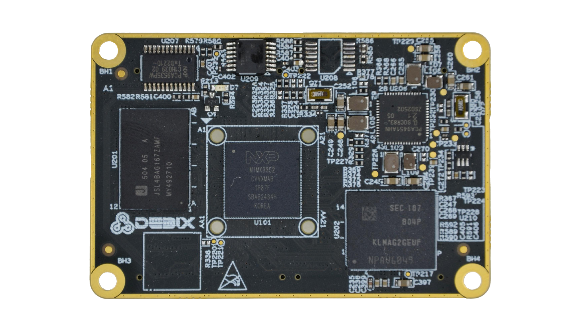
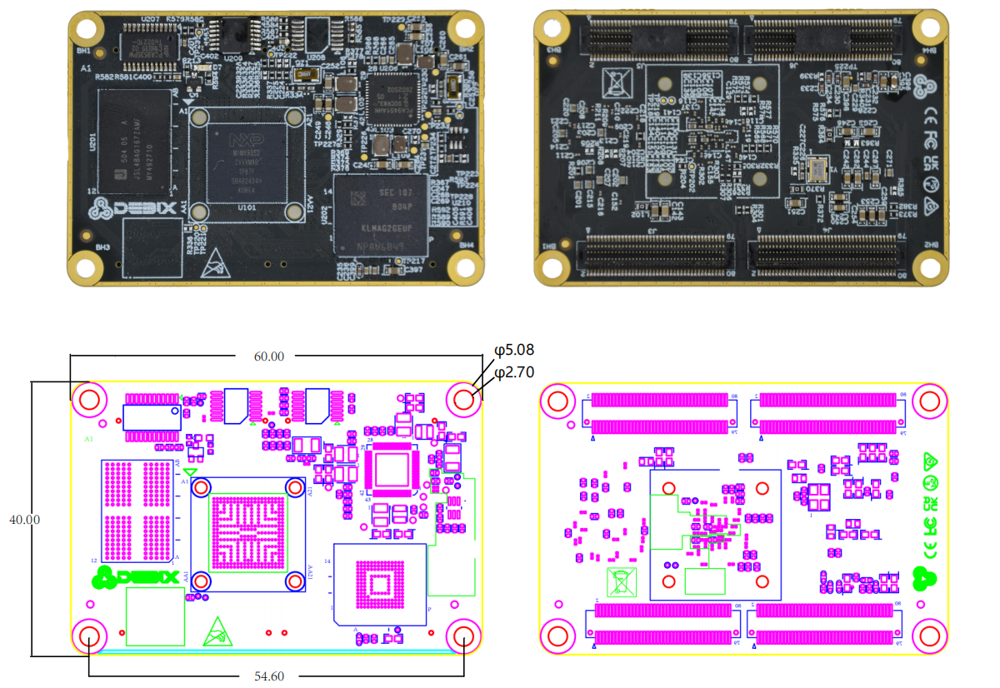

# DEBIX SOM B i.MX 93 Core Board
 

## Overview
DEBIX SOM B is the second System-on-Module product of the DEBIX series. As with the DEBIX Model C SBC, it is based on NXP i.MX 93 CPU with a 0.5 TOPS microNPU, which brings us the same powerful system performance. This core board design has some notable benefits, such as design reutilization, reduction of development time of thecarrier boards, and flexible integration into various embedded systems.

## Main Features
- **Industrial-grade performance:** Designed for demanding applications in Industry 4.0,
IoT, smart cities, and multimedia.
- **Comprehensive software support:** Includes Yocto, Ubuntu, Debian, OpenWRT and 
FreeRTOS operating systems.
- **Real-time control:** General-purpose Cortex-M33 up to 250MHz for real-time and low-power processing.

 

## Specification
| **System**          |             |
|---------------------|-------------|
| CPU                 | NXP i.MX 9352, 2 x Arm® Cortex®-A55 @1.7GHz, 1 x Arm® Cortex®-M33 @250MHz, 1 x Arm® Ethos™U65 microNPU @0.5TOPS (i.MX 93 series CPU optional) |
| Memory              | 2GB LPDDR4 (1GB optional) |
| Storage             | Onboard 16GB eMMC (8GB/32GB/64GB/128GB/256GB optional) |
| OS                  | Ubuntu22.04, Yocto-L6.12.3_1.0.0, Debian 12 (also supports OpenWRT and FreeRTOS) |
| **I/O Interfaces**  |             |
| Gigabit Ethernet    | Up to 2 x Gigabit Ethernet controller, one of which supports Time Sensitive Networking (TSN) |
| Display             | 1 x LVDS (4-lane), supports up to 1366x768@60Hz or 1280x800@60Hz 1 x MIPI DSI (4-lane), supports up to 1080@60Hz or 1920x1200@60Hz 1 x 24-bit parallel RGB, supports up to 1366x768@60Hz or 1280x800@60Hz |
| Camera              | 1 x MIPI CSI, supports up to 2 RX data lanes (plus 1 Rx clock lane) Compliant with MIPI CSI-2 v1.3 and MIPI D-PHY v1.2 specifications |
| Audio               | Up to 3 x SAI (synchronous audio interface) 1 x SPDIF OUT/IN 1 x PDM |
| USB                 | 2 x USB 2.0 |
| UART                | Up to 8 x UART |
| I2C                 | Up to 6 x I2C |
| SDIO                | Up to 2 x SDIO3.0 |
| CAN                 | Up to 2 x CAN |
| SPI                 | Up to 8 x SPI |
| ADC                 | Up to 4 x 12-bit ADC (4-channel) |
| JTAG                | 1 x JTAG |
| **Power Supply**    |             |
| Power Input         | DC 3.5V~5V/1A |
| **Operating Temperature** | |
| Temp. Range         | -40°C~85°C for default -20°C~70°C optional |
| **Mechanical**      |             |
| Connector           | 4 x 2*40pin/0.5mm pitch board-to-board connector (PN: BB51024A-R80-10-32), matching sockets of various heights |
| Dimension           | 60mm(L) x 40mm(W) x 5.6mm(H) (±0.5mm) |
| Gross Weight        | 23g (±0.5g) |
| Net Weight          | 11g (±0.5g) |

## Certificates:

## Ordering Codes
| RAM LPDDR4 | eMMC Storage | PN (-20°C~70°C) | PN (-40°C~85°C) |
|------------|--------------|-----------------|-----------------|
| **1GB DDR**| 8GB          | SOM B-D1E8      | SOM B-I-D1E8    |
|            | 16GB         | SOM B-D1E16     | SOM B-I-D1E16   |
|            | 32GB         | SOM B-D1E32     | SOM B-I-D1E32   |
|            | 64GB         | SOM B-D1E64     | SOM B-I-D1E64   |
| **2GB DDR**| 8GB          | SOM B-D2E8      | SOM B-I-D2E8    |
|            | 16GB         | SOM B-D2E16     | SOM B-I-D2E16   |
|            | 32GB         | SOM B-D2E32     | SOM B-I-D2E32   |
|            | 64GB         | SOM B-D2E64     | SOM B-I-D2E64   |

## Compatible with DEBIX's Accessories
| Product                     | Model               |
|-----------------------------|---------------------|
| SOM A I/O Board            | BMB-08               |
| Camera Adapter Board       | EMB-AS-08          |
| DEBIX Camera Modules       | Camera 200A; Camera 500A |
| DEBIX Display Screens      | DEBIX TD050A; DEBIX TD070A; DEBIX TD101A |

## Safety Instructions and Warnings:
**General:**
- Avoid exposure to water, moisture and conductive surfaces while operating.
- Handle with care to avoid mechanical or electrical damage to the circuit board and connectors.
- Only handle the board by the edges when powered on to minimize the risk of electrostatic discharge damage.

**Power:**
- Use the product with a carrier board and connect it to a 3.5V~5V/1A external power supply that complies with relevant regulations and standards for your country.

**Environment:**
- Operate in a well-ventilated environment, even if using a case.
- Place on a stable, flat, non-conductive surface and avoid contact with conductive items.

**Connections:**
- Only connect compatible devices to the GPIO ports to avoid damage and warranty
voiding.
- Use peripherals that comply with relevant standards for the country of use and ensure proper insulation and operation.

**Additional notes:**
- This summary is not exhaustive, please refer to the full User Manual for details.
- If you are unsure about any aspect of safety or operation, consult a qualified
professional.

## Contact Us
- **Headquarters**: DEBIX Technology Inc., 8345 Gold River Ct., Las Vegas, NV 89113, USA  
- **Factory**: 5-6/F., East Zone, Shunheda A2 Building, Liqxiandong Industrial Park, XiLi, Nanshan Dist., Shenzhen, China  
- **Email**: info@debix.io  
- **Website**: [www.debix.io](https://www.debix.io)  
- **Community**: [Discord](https://discord.com/invite/adaHHaDkH2)